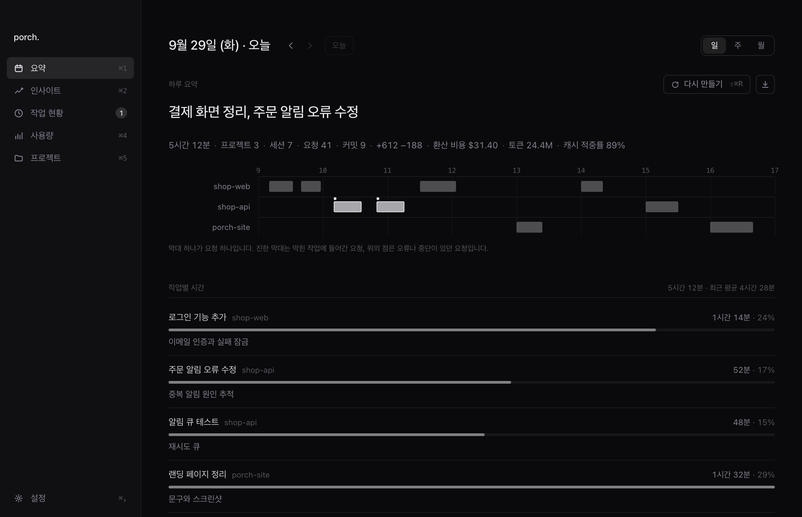

<div align="center">
  
  <h1>porch.</h1>
  <p><strong>코딩 에이전트와 한 일을 남기는 오픈소스 작업 일지.</strong></p>
  <p>클로드코드와 코덱스로 한 일, 시간이 어디로 갔는지, 어디서 막혔는지를 프로젝트별로 하루·한 주·한 달 단위로 정리하는 맥 앱입니다.</p>
  <p>
    <a href="https://getporch.pages.dev/Porch.dmg">맥용 다운로드</a> ·
    <a href="docs/README.md">문서</a> ·
    <a href="README.md">English</a>
  </p>
</div>



## 할 수 있는 일

- **요약** — 프로젝트별로 하루·한 주·한 달 동안 한 일과 작업별 추정 시간, 막힌 곳을 정리합니다. 10분 넘게 쉰 구간은 빼고 동시에 돌린 작업은 두 번 세지 않으며, 막힌 원인을 기록으로 알 수 없으면 알 수 없다고 씁니다. 남은 일과 막힘은 기록으로 끝난 게 확인될 때까지 다음 날로 이어집니다.
- **노트와 알림** — 요약을 내가 고른 폴더(보통 Obsidian 볼트)에 마크다운으로도 저장합니다([형식](docs/design/note-format.md)). 요약을 저장하거나 다시 만들면 직접 고친 내용까지 새로 쓰므로, 메모는 다른 노트에 쓰고 그곳에서 porch 노트를 링크하세요. 자동 요약이 끝나면 한 줄 요약을 알림으로 보여 줍니다.
- **작업 현황** — 어느 터미널이나 편집기에서 띄웠든 이 맥의 클로드코드·코덱스 세션과, 그중 나를 기다리는 세션을 보여 줍니다. 메뉴바에 그 수가 뜹니다.
- **사용량** — 프로젝트·모델·도구별 토큰과 환산 비용, 클로드·코덱스의 5시간·주간 한도를 보여 줍니다. 환산 비용은 토큰에 공개 API 가격을 곱한 값이라 구독으로 내는 돈과 다릅니다. porch가 요약을 쓰는 데 쓴 토큰은 세지 않습니다.

## 설치

1. **[Porch.dmg](https://getporch.pages.dev/Porch.dmg)** 를 받아 Porch를 응용 프로그램 폴더로 옮깁니다.
2. Porch를 열고 **세션 감지 켜기** 항목의 **켜기**를 누릅니다. 기존 설정은 먼저 백업하고, 다른 도구의 훅은 건드리지 않습니다. 다음에 코덱스를 켜면 새 훅을 승인해야 코덱스 세션도 잡힙니다.
3. **시작하기**를 누릅니다. **요약** 화면에서 작업 기록이 있는 날을 고르고 **요약 만들기**를 누릅니다.

Apple Silicon 맥이 필요합니다. 요약에는 [클로드코드](https://docs.claude.com/en/docs/claude-code)나 [코덱스](https://developers.openai.com/codex) 설치와 로그인이 필요하고, **설정**의 **요약 에이전트**에서 고릅니다. 클로드 한도는 Pro나 Max 구독에서 **설정**의 **클로드 사용 한도 가져오기**를 켜야 나옵니다. 소스에서 빌드하려면 [CONTRIBUTING.md](CONTRIBUTING.md#build-from-source)를 보세요.

## CLI

**설정**에서 **터미널 명령**을 켜면 앱 안의 `porch`를 `/usr/local/bin/porch`로 연결합니다(관리자 암호를 물을 수 있습니다). CLI는 앱과 같은 기록을 읽습니다.

```sh
porch now       # 지금 세션과 나를 기다리는 세션 (스크립트용은 --json)
porch today     # 오늘 요약 (--date, --md, --json, --refresh)
porch week      # 이번 주 요약 (한 달은 month)
porch usage     # 토큰과 비용, JSON
porch limits    # 클로드·코덱스 한도, JSON
porch help      # 모든 명령
```

아직 저장되지 않은 요약은 모델을 부르므로, 코딩 에이전트가 `porch`를 부를 때는 `porch now --json`, `porch usage`, `porch today --no-llm --json`처럼 읽기만 하는 명령을 쓰는 게 좋습니다.

## 개인정보

- 작업 기록을 위한 porch 계정이나 서버는 없습니다. 세션 상태, 토큰, 비용은 맥 밖으로 나가지 않고, 훅은 아무것도 보내지 않습니다.
- 요약, 제안, 막힘 유형 분류, 주간 평가에 필요한 기록을 고른 에이전트를 거쳐 모델로 보냅니다. 클로드코드면 Anthropic, 코덱스면 OpenAI입니다.
- 앱은 익명 사용 기록을 PostHog로 보냅니다. **설정**의 **사용 기록 보내기**에서 끌 수 있습니다.

앱이 읽고, 저장하고, 보내는 것 전체와 웹사이트·다운로드 링크가 세는 것: [docs/privacy.md](docs/privacy.md)(영어).

## 지원하는 에이전트

| 에이전트 | 작업 현황 | 사용량 | 요약 |
| --- | --- | --- | --- |
| 클로드코드 | ✓ | ✓ | ✓ |
| 코덱스 | ✓ | ✓ | ✓ |

어느 에이전트가 쓰든 두 에이전트의 기록을 함께 요약합니다. OpenRouter를 거친 모델의 비용은 가장 싼 공급자 기준의 최소 금액이고, 가격을 모르는 모델은 토큰만 보여 줍니다. 다른 에이전트가 필요하면, 그 에이전트가 세션 기록을 어디에 두는지 적어 이슈를 열어 주세요.

## 더 보기

- [docs/](docs/README.md): 상태 규칙, 결정 기록, 설계 문서(영어)
- [AGENTS.md](AGENTS.md): 빌드, 테스트, 저장소 규칙. 사람과 코딩 에이전트 모두를 위한 문서
- [CONTRIBUTING.md](CONTRIBUTING.md) · [SECURITY.md](SECURITY.md)

## 라이선스

[AGPL-3.0-only](LICENSE). Copyright (C) 2026 amone-labs. 기여 방법은 [CONTRIBUTING.md](CONTRIBUTING.md)를 보세요.
