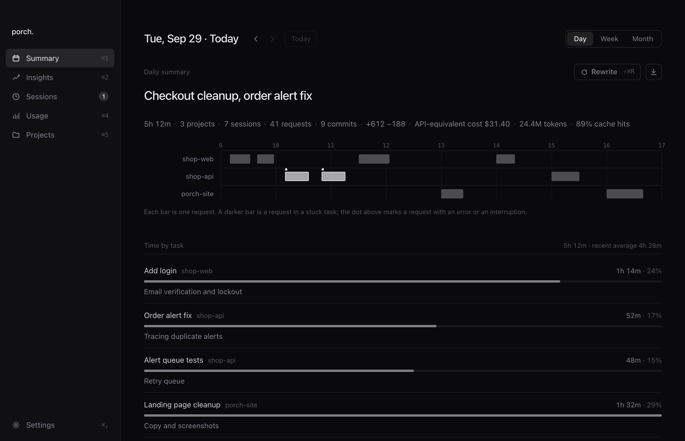

<div align="center">
  
  <h1>porch.</h1>
  <p><strong>An open-source work log for your coding agents.</strong></p>
  <p>A Mac app that summarizes your Claude Code and Codex work by project, day, week and month: what you did, where the time went, what got stuck.</p>
  <p>
    <a href="https://getporch.pages.dev/Porch.dmg">Download for macOS</a> ·
    <a href="docs/README.md">Docs</a> ·
    <a href="README.ko.md">한국어</a>
  </p>
</div>



## Features

- **Summaries** — what you did each day, week and month, per project, with estimated time per task and what got stuck. Breaks over 10 minutes are left out and parallel work counts once; when the records don't show why something got stuck, the summary says so. Open work and blockers carry over until the records show them done.
- **Notes and notifications** — summaries can also be saved as Markdown in a folder you pick, usually an Obsidian vault ([format](docs/design/note-format.md)). Saving or rewriting a summary replaces its note, edits included, so keep your own notes elsewhere and link to the porch note from there. When an automatic summary finishes, a notification shows its one-line summary.
- **Sessions** — Claude Code and Codex sessions on this Mac, whichever terminal or editor launched them, and which ones wait on you. The menu bar shows how many.
- **Usage** — tokens and API-equivalent cost by project, model and tool, plus Claude and Codex 5-hour and weekly limits. API-equivalent cost is tokens times public API prices, not your subscription bill. Tokens porch spends writing summaries are not counted.

## Install

1. Download **[Porch.dmg](https://getporch.pages.dev/Porch.dmg)** and move Porch to Applications.
2. Open it and, under **Turn on session detection**, press **Turn on**. Your agent settings are backed up first and other tools' hooks are left alone. The next time you start Codex, approve the new hook so Codex sessions show up.
3. Press **Get started**. On **Summary**, pick a day with recorded work and press **Make summary**.

Needs an Apple Silicon Mac. Summaries need [Claude Code](https://docs.claude.com/en/docs/claude-code) or [Codex](https://developers.openai.com/codex) installed and signed in; pick one under **Summary agent** in **Settings**. Claude limits need a Pro or Max plan and **Import Claude limits** turned on in **Settings**. To build from source, see [CONTRIBUTING.md](CONTRIBUTING.md#build-from-source).

## CLI

Turn on **Terminal command** in **Settings** to link `/usr/local/bin/porch` to the copy inside the app (it may ask for your password). The CLI reads the same records as the app.

```sh
porch now       # sessions and which ones wait on you (--json for scripts)
porch today     # today's summary (--date, --md, --json, --refresh)
porch week      # this week's summary (month for the month)
porch usage     # tokens and cost as JSON
porch limits    # Claude and Codex limits as JSON
porch help      # every command
```

A summary that is not saved yet calls the model, so coding agents calling `porch` should stick to read-only commands such as `porch now --json`, `porch usage` and `porch today --no-llm --json`.

## Privacy

- No porch account or server is needed for your work records. Session state, tokens and cost never leave your Mac, and the hook sends nothing.
- Summaries, suggestions, blocker classification and the weekly evaluation send what they need to the model through the agent you pick: Claude Code (to Anthropic) or Codex (to OpenAI).
- The app sends anonymous usage events to PostHog. Turn them off with **Send app usage events** in **Settings**.

Everything the app reads, stores and sends, and what the website and download link count: [docs/privacy.md](docs/privacy.md).

## Supported agents

| Agent | Session status | Usage | Summaries |
| --- | --- | --- | --- |
| Claude Code | ✓ | ✓ | ✓ |
| Codex | ✓ | ✓ | ✓ |

Either agent writes summaries of both agents' records. Cost for models routed through OpenRouter is a lower bound based on the cheapest provider; models without a known price show tokens only. Want another agent? Open an issue with where it keeps its session records.

## More

- [docs/](docs/README.md): state rules, decisions and design
- [AGENTS.md](AGENTS.md): build, test and repo rules, for people and coding agents
- [CONTRIBUTING.md](CONTRIBUTING.md) · [SECURITY.md](SECURITY.md)

## License

[AGPL-3.0-only](LICENSE). Copyright (C) 2026 amone-labs. To contribute, see [CONTRIBUTING.md](CONTRIBUTING.md).
