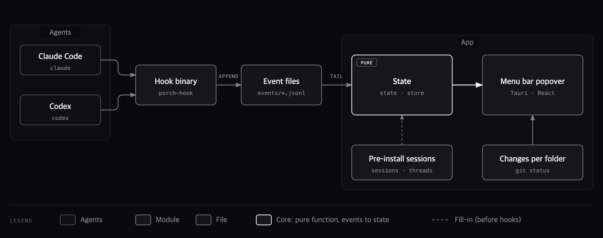

# Architecture

The hook appends events to files, and the app follows those files to update session state. State is computed by a pure function, so it is tested by feeding it event sequences.



## Stack

The hardest part is not the screens but catching sessions accurately. So "receive facts through hooks" was settled first, and the stack was picked on top of it. ([ADR 0004](../decisions/0004-stack.md))

| Area | Choice | Alternative | Why |
| --- | --- | --- | --- |
| Collecting state | hook binary `porch-hook` (Rust) | interpreting record files | uses only events the agent itself reports; finishes within 10 ms and never blocks the agent |
| Hook → app | per-day append-only files the app tails | Unix socket | no events are lost while the app is off |
| App shell | Tauri 2 (tray + popover window) | Swift `MenuBarExtra` | a menu bar popover needs only one transparent window and AppKit coordinates; unrelated to the core risk |
| Core logic | Rust crate `core` | TypeScript on the screen side | shares the event format with the hook binary |
| Screens | React + TypeScript + Vite + Tailwind | Svelte | existing experience |
| Storage | SQLite (`rusqlite`) | memory only | keep sessions and read positions across restarts |
| Git | `git status --porcelain=v2` once per work folder | a call per session | one query even when several sessions share a folder |
| Transcripts | read only for summaries and token counts, never stored as state | interpreting them continuously | performance (records total over 1 GB) and privacy |
| Distribution | Developer ID signing + notarization, direct download | App Store | a sandboxed app cannot install hooks into another app's settings files |

## Modules

| Module | What it does | Input → output |
| --- | --- | --- |
| `porch-hook` (separate binary) | called by the agent, writes one event line and exits; exit code 0 on any failure | hook input JSON + environment → one line in the event file |
| `install` (`core`) | adds and removes hooks in Claude Code's settings and every `CODEX_HOME` (existing hooks preserved). `porch install` and the app share this code | settings files → settings files |
| `ingest` | tails the event files; handles a cut-off last line, duplicate events and replaced files | event files → `Event` |
| `discover` | fills in sessions from before the install with the session registry files and Codex's `threads` table; checks whether processes are alive | files, processes → session list |
| `state` | turns events into states and markers (pure function) | previous state + event → new state |
| `git` | uncommitted change count per work folder; requests within 5 seconds are merged into one run | folder → change count |
| `store` | saves sessions and read positions | ↔ SQLite |
| `health` (`core`) | from the last 30 days of reports and the open-items ledger, counts per project the request time spent blocked, blocker kinds, commands that failed on several days and long-open blockers. A request (`Turn`) counts toward the repository where it edited the most files (`Turn.root`). Calls no model | `reports/*.json`, `open.json` → per-project numbers and checks |
| `suggest` (`core`) | builds material from the checks, blocker text and instruction files, gets suggestions from the summary agent, and saves under a lock to `suggestions.json` only those whose target and evidence are in the material. `health::effect` counts the effect of applied suggestions | reports, checks, CLAUDE.md → suggestions |
| `insight_eval`·`goals` (`core`) | turns a finished week's request flow into material from the day summaries, sends it to the same summary agent (0010) and scores four items with the rubric's sentences. Every score needs a quote from a request, and one that does not match the records is dropped. The settled observed numbers, the evaluation and disputes are saved under a lock to `reports/insight-<monday>.json`. Next week's goal is saved to `goals.json` and compared as the same measure over two periods of the same length (never written as cause). Turned off in Settings, it calls no model | day summaries, observed numbers, last week's goal → evaluation, `goals.json` |
| `mirror` (`core`) | writes saved day, week and month summaries as notes with frontmatter and links to a folder the user picks (usually `porch/` inside an Obsidian vault). porch rewrites these notes on every save ([ADR 0009](../decisions/0009-porch-notes-are-rewritten.md)). Obsidian's vault list is only read ([note format](note-format.md)) | reports, `settings.json` → notes, `mirror.json` |
| `lang` (`core`) | picks the language from the setting (`system`, `ko`, `en`). `system` is Korean when macOS's first preferred language is Korean, English otherwise. A summary run fixes the language when it starts (`Engine.lang`), and the instructions, material labels, post-processed text and the saved `lang` all use it ([ADR 0011](../decisions/0011-english.md)). `porch-hook` does not use it | settings, system language → `Lang` |
| `schedule` (`core`) | from the automatic summary time and the current time, picks the most recent day, week (last week, on Mondays) and month (last month, on the 1st) not saved yet. A pure function that never reads the clock | times, saved reports → periods to make |
| App (Tauri) | tray count, popover, settings, bringing a session's window to the front | `core` results → screens |

## Event format

One line at a time in `~/Library/Application Support/<app>/events/YYYY-MM-DD.jsonl`.

```json
{"v":1,"t":1790472637772,"agent":"claude","session":"a929bee5-…","event":"PermissionRequest","tool":"Bash","cwd":"/Users/…/shop-api","log":"/Users/…/a929bee5-….jsonl","pid":60827,"term":{"program":"orca","pane":"8f3c9416-…"}}
```

- `v` is the format version. The app counts unknown versions and unknown events instead of dropping them silently.
- Each line is written with a single `write` to a file opened with `O_APPEND`. Short appends to a local file do not interleave in practice, but POSIX does not guarantee it, so `ingest` drops lines that do not parse as JSON and counts them.

## Hook cost (measured 2026-09-27, 500 runs)

| Measurement | Median | p95 |
| --- | --- | --- |
| Bare process (`/usr/bin/true`, baseline) | 4.4 ms | 10.3 ms |
| `porch-hook` run directly | 6.6 ms | 11.5 ms |
| The installed command as is (through `sh -c`) | 14.2 ms | 23.0 ms |

`porch-hook` itself costs about 2 ms over the baseline. The rest is the cost of starting a process and a shell; agents run every hook command through a shell, so other hooks pay the same. The release build is 336 KB.

## Storage (SQLite)

```sql
create table session (
  id             text primary key,  -- agent + session id
  agent          text not null,     -- 'claude' | 'codex'
  pid            integer,
  proc_start     text,              -- tells reused pids apart
  cwd            text not null,
  worktree_root  text,              -- git rev-parse --show-toplevel
  title          text,
  state          text not null,     -- permission | question | failed | turn_done | running | ended
  subagents      integer not null default 0,
  last_event_at  integer not null,
  log_path       text,
  term_program   text,
  term_pane      text
);

create table worktree (root text primary key, dirty_count integer, checked_at integer);
create table ingest_cursor (file text primary key, offset integer not null);
create table excluded (path_prefix text primary key);
create table unknown_event (kind text primary key, count integer not null, last_seen integer);
```

## Folders

```
porch/
  Cargo.toml              # workspace
  crates/core/            # event, install, ingest, discover, state, git, store; the event format is defined here
  crates/hook/            # porch-hook binary (depends only on core's event format, kept small)
  crates/cli/             # first a validation CLI (prints the current state), later the public CLI
  app/src-tauri/          # tray, popover window, calls into core
  app/src/                # React screens
```

The build order is `crates/hook` → `crates/core` → `crates/cli` → `app`. Hook validation, CLI comparison and the state tests need only the first three, with no screens.
